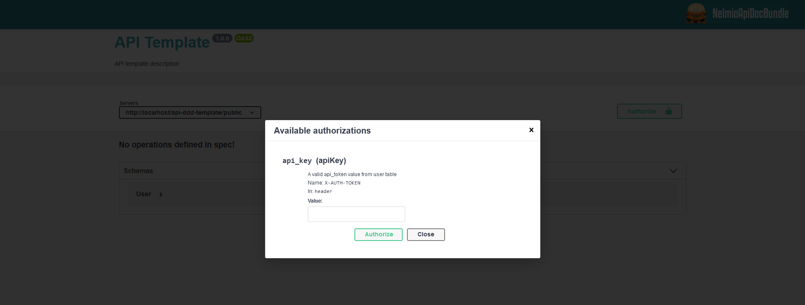
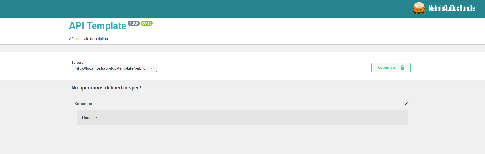
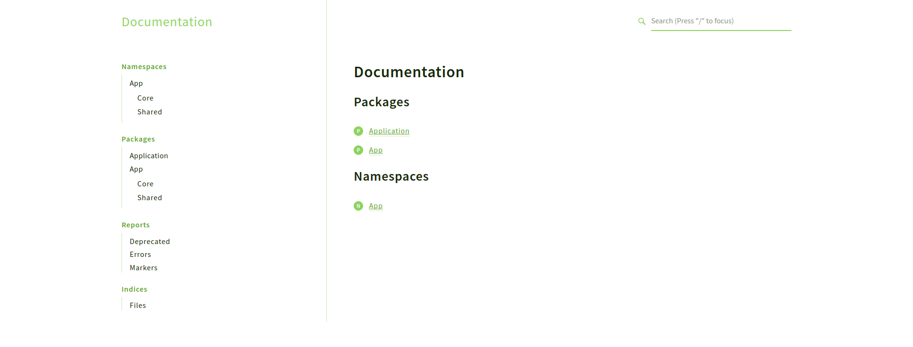

# api-ddd-template

1. [About project](#about-project)
1. [Set up project](#set-up-project)
    * [Installation](#installation)
    * [Configure environment variables](#configure-environment-variables)
    * [Create database](#create-database)
    * [Execute project](#execute-project)
    * [Execute all tests](#execute-all-tests)
1. [Unit Tests](#unit-tests)
    * [PHP Unit](#php-unit)
1. [Code Quality Checker Tools](#code-quality-checker-tools)
    * [PHP_CodeSniffer](#php_codesniffer)
    * [PHPStan](#phpstan)
    * [PHP Mess Detector](#php-mess-detector)
    * [PHP Magic Number Detector](#php-magic-number-detector)
    * [PHP Copy Paste Detector](#php-copy-paste-detector)
    * [Churn-php](#churn-php)
    * [PhpDeprecationDetector](#phpDeprecationDetector)
    * [Twigcs](#twigcs)
1. [Code Analysis Tools](#code-analysis-tools)
    * [Deptrac](#deptrac)
1. [Documentation](#documentation)
1. [Future improvements](#future-improvements)

## About project
- [x] Symfony 4.4
- [x] Docker with PHP 8 and MySQL 5.7 containers
- [x] Makefile
- [x] Packages installed: Symfony Flex, Doctrine, Security, NelmioApiDocBundle, MakerBundle, DoctrineFixturesBundle and PHPUnit among others
- [x] DDD and Hexagonal architecture
- [x] Best practices: Clean code, PHP Standards Recommendations (PSR), SOLID principles and design patterns
- [x] Unit tests: PHP Unit
- [x] Code Quality Checker Tools: PHP_CodeSniffer, PHPStan, PHP Mess Detector, PHP Magic Number Detector, PHP Copy Paste Detector, Churn-php, PhpDeprecationDetector, Twigcs
- [x] Code Analysis Tools: Deptrac
- [x] Exceptions handler
- [x] Database full dump with test data included in `migrations` folder

## Set up project

If not already done, [install Docker Compose](https://docs.docker.com/compose/install/) before continue with installation.

### Installation

Clone repository:

    git clone https://github.com/burus86/api-ddd-template.git

    cd api-ddd-template

Build and up docker containers:

    make start

Install composer dependencies:

    make install

### Configure environment variables

Rename filename `.env.dist` as `.env` and edit `DATABASE_URL` value with database parameters

Open filename `.env.test` and edit `DATABASE_URL` value with test database parameters.

### Create database

Execute the following commands to create an empty database with the name specified in `.env` filename:

    make bash

    php bin/console doctrine:database:create

    php bin/console doctrine:schema:update --force

Execute the following command in order to dump fake data in database tables:

    php bin/console doctrine:fixtures:load

Alternatively, you can either import the `db-api-ddd-template-full.sql` file, included in `migrations` folder, to create and populate the database schema, however this file might not be up to date.

    docker exec -it api-ddd-template_db bash

    mysql -uroot -p

    create database db_api_ddd_template;

    exit;

    mysql -uroot -p db_api_ddd_template < /var/backups/db-api-ddd-template-full.sql

### Execute project

Open in your favorite web browser the website [http://localhost:8080/api/doc](http://localhost:8080/api/doc).

All API endpoints require a `X-AUTH-TOKEN` in header, with a value equal to field api_token in user table. Example: `cU70Sbr0qKrUQHE0tw60XQVMwBP8hJrdRMY61xhX`

### Execute all tests

To run all the tests (unit tests, code quality checker tools and code analysis tools), just execute the command `make test` with [option -i or --ignore-errors](https://www.gnu.org/software/make/manual/make.html#Options-Summary):

    make test -i

If you prefer, it's also possible to run each individual test following the instructions below.

## Unit Tests

### [PHP Unit](https://github.com/sebastianbergmann/phpunit)

    make test-phpunit

## Code Quality Checker Tools

**Source:**

- https://thevaluable.dev/code-quality-check-tools-php/
- https://github.com/collections/code-quality-in-php

### [PHP_CodeSniffer](https://github.com/squizlabs/php_codesniffer)

    make test-phpcs

In order to automatically correct coding standard violations, execute:

    make test-phpcbf

### [PHPStan](https://github.com/phpstan/phpstan)

    make test-phpstan

### [PHP Mess Detector](https://github.com/phpmd/phpmd)

    make test-phpmd

### [PHP Magic Number Detector](https://github.com/povils/phpmnd)

    make test-phpmnd

### [PHP Copy Paste Detector](https://github.com/sebastianbergmann/phpcpd)

    make test-phpcpd

### [Churn-php](https://github.com/bmitch/churn-php)

`churn-php` is a package that helps you identify php files in your project that could be good candidates for refactoring.

    make test-churn

### [PhpDeprecationDetector](https://github.com/wapmorgan/PhpDeprecationDetector)

    make test-phpdd

### [Twigcs](https://github.com/friendsoftwig/twigcs)

    make test-twigcs

## Code Analysis Tools

### [Deptrac](https://github.com/qossmic/deptrac)

    make test-deptrac

## Documentation

The easiest way to [generate full project documentation](https://github.com/phpdocumentor/phpdocumentor) is by running the following command:

    php phpDocumentor.phar -d src -t public/docs

Once generated, you can check the documentation under [http://localhost:8080/docs](http://localhost:8080/docs) in your favorite web browser.

## Future improvements

- [x] **[Upgrade PHP](https://www.php.net/supported-versions.php)** to latest stable version: 8.0
- [x] Add docker configuration files
- [ ] **[Upgrade Symfony](https://symfony.com/releases)** to latest stable version: 5.3
- [ ] Add **[JWT authentication](https://github.com/lexik/LexikJWTAuthenticationBundle)**, which replace current API Key defined in user
- [ ] Create **[application tests](https://symfony.com/doc/current/testing.html#application-tests)**, to check the integration of all the different layers of the application.
- [ ] Install **[serializer component](https://symfony.com/doc/current/components/serializer.html#installation)** to normalize objects as JSON and hide specific fields
- [ ] Use **[DoctrineMigrationsBundle](https://symfony.com/doc/current/bundles/DoctrineMigrationsBundle/index.html#usage)**
- [ ] Add **uuid** field for each model and hide id field on JSON responses
