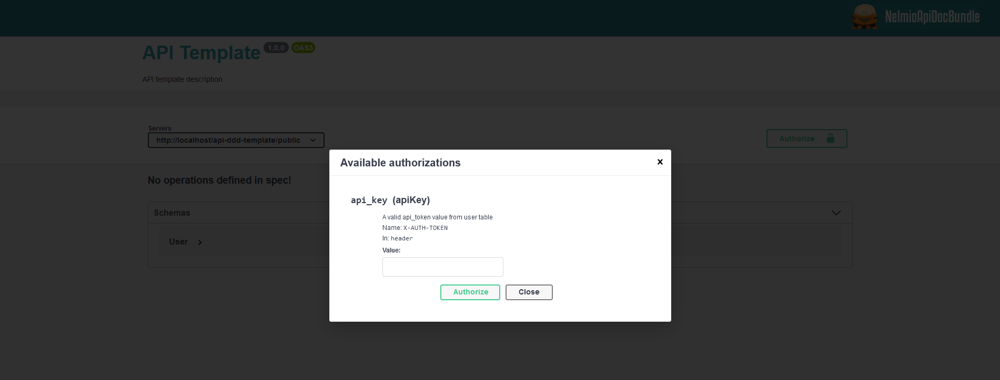
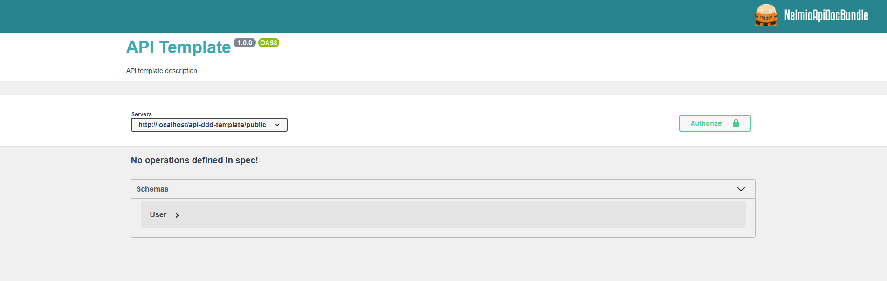

# api-ddd-template

1. [About project](#about-project)
1. [Installation](#installation)
1. [Configure environment variables and create database](#configure-environmment-variables-and-create-database)
1. [Run project](#run-project)
1. [Run Tests](#run-tests)
1. [Future improvements](#future-improvements)

## About project
- [x] Symfony 4.4
- [x] Packages installed: Symfony Flex, Doctrine, Security, NelmioApiDocBundle, MakerBundle, DoctrineFixturesBundle and PHPUnit among others
- [x] DDD and Hexagonal architecture
- [x] Best practices: Clean code, PHP Standards Recommendations (PSR), SOLID principles and design patterns
- [x] Unit testing
- [x] Exceptions handler
- [x] Database full dump with test data included in `migrations` folder

## Installation
Clone repository:

    git clone https://github.com/burus86/api-ddd-template.git

Install dependencies:

    cd api-ddd-template

    composer install

## Configure environmment variables and create database

Rename filename `.env.dist` as `.env` and edit `DATABASE_URL` value with database parameters

Execute the following commands to create an empty database with the name specified in `.env` filename:

    php bin/console doctrine:database:create

    php bin/console doctrine:schema:update --force

Execute the following command in order to dump fake data in database tables:
    
    php bin/console doctrine:fixtures:load

Alternatively, you can either import the `db-api-ddd-template-full.sql` file, included in `migrations` folder, to create and populate the database schema, however this file might not be up to date.

## Run project

Follow instructions to install a [Symfony Local Web Server](https://symfony.com/doc/4.4/setup/symfony_server.html) and then open a new tab with the following URL: 

[http://127.0.0.1:8000/api/doc](http://127.0.0.1:8000/api/doc)

Alternatively, if you use [XAMPP](https://www.apachefriends.org/es/download.html), open the URL:

[http://localhost/api-ddd-template/public/api/doc](http://localhost/api-ddd-template/public/api/doc)

All API endpoints require a `X-AUTH-TOKEN` in header, with a value equal to field api_token in user table. Example: `cU70Sbr0qKrUQHE0tw60XQVMwBP8hJrdRMY61xhX`

## Run Tests

    vendor/bin/phpunit

## Future improvements

- [ ] **[Upgrade Symfony](https://symfony.com/releases)** to latest stable version: 5.3
- [ ] Add docker configuration files
- [ ] Add **[JWT authentication](https://github.com/lexik/LexikJWTAuthenticationBundle)**, which replace current API Key defined in user
- [ ] Create **[application tests](https://symfony.com/doc/current/testing.html#application-tests)**, to check the integration of all the different layers of the application.
- [ ] Install **[serializer component](https://symfony.com/doc/current/components/serializer.html#installation)** to normalize objects as JSON and hide specific fields
- [ ] Use **[DoctrineMigrationsBundle](https://symfony.com/doc/current/bundles/DoctrineMigrationsBundle/index.html#usage)**
- [ ] Add **uuid** field for each model and hide id field on JSON responses
